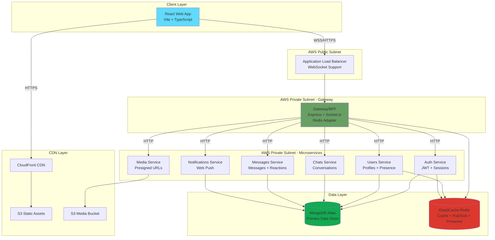
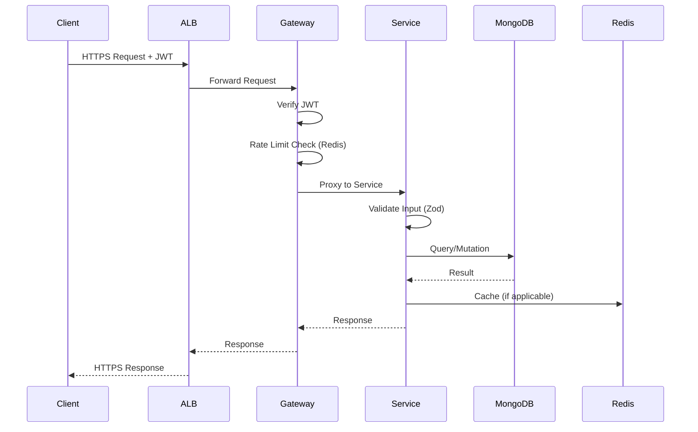
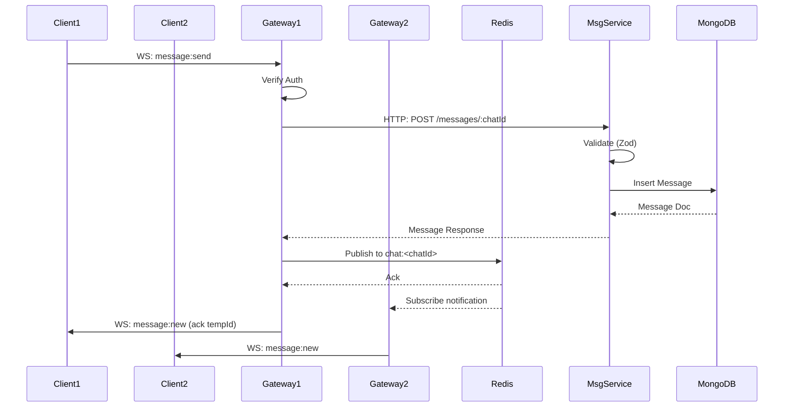
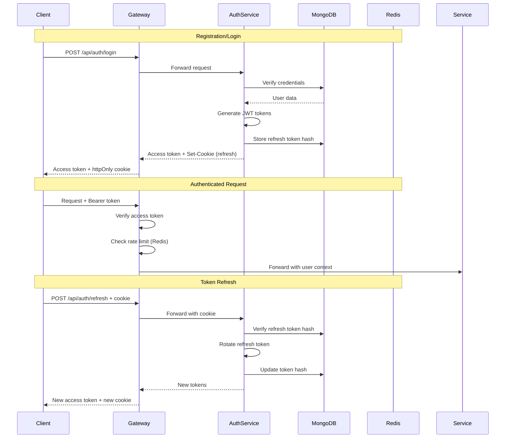

# Design Document

## Overview

This design document outlines the architecture for a production-ready, WhatsApp-style real-time chat application built as a monorepo. The system follows a microservices architecture with a Gateway/BFF pattern, designed to scale horizontally to support 1,000+ concurrent users.

### Key Design Principles

1. **Separation of Concerns**: Each microservice handles a specific domain (auth, users, chats, messages, media, notifications)
2. **API Gateway Pattern**: Single public entry point (Gateway/BFF) that routes to internal services
3. **Real-time First**: WebSocket-based communication with Socket.io and Redis pub/sub for horizontal scaling
4. **Security by Default**: JWT-based authentication, httpOnly cookies, rate limiting, input validation
5. **Scalability**: Stateless services, Redis-based session/presence, cursor-based pagination, optimized indexes
6. **Developer Experience**: Monorepo with shared packages, TypeScript everywhere, hot reload, comprehensive tooling
7. **Infrastructure as Code**: Complete Terraform modules for reproducible AWS deployments

### Technology Stack

**Frontend:**

- React 18 with TypeScript
- Vite for build tooling
- Tailwind CSS for styling
- React Router for navigation
- React Query (TanStack Query) for server state
- Zustand for lightweight client state
- Socket.io-client for WebSocket communication

**Backend:**

- Node.js with TypeScript
- Express.js for HTTP APIs
- Socket.io for WebSocket with Redis adapter
- MongoDB (Atlas) for persistent storage
- Redis (ElastiCache) for caching, presence, rate limiting, pub/sub
- Zod for runtime validation
- Pino for structured logging
- Bcrypt for password hashing
- JWT for authentication

**Infrastructure:**

- AWS ECS Fargate for container orchestration
- AWS ALB for load balancing (WebSocket-capable)
- AWS S3 + CloudFront for static assets and media
- AWS ElastiCache (Redis) for caching and pub/sub
- AWS Secrets Manager for secrets
- AWS ECR for container registry
- Terraform for IaC
- GitHub Actions for CI/CD

**Monorepo Tooling:**

- pnpm for package management
- Turborepo for build orchestration
- ESLint + Prettier for code quality
- Jest/Vitest for testing
- Docker + Docker Compose for local development

## Architecture

### High-Level Architecture



### Request Flow Patterns

#### HTTP API Request Flow



#### WebSocket Message Flow



### Monorepo Structure

```
whatsapp-chat-monorepo/
├── .github/
│   └── workflows/
│       ├── web-deploy.yml              # Frontend deployment to S3/CloudFront
│       └── service-build-deploy.yml    # Backend services to ECR/ECS
├── .kiro/
│   └── specs/
│       └── whatsapp-chat-monorepo/
├── apps/
│   ├── web/                            # React frontend
│   │   ├── src/
│   │   │   ├── components/
│   │   │   ├── pages/
│   │   │   ├── hooks/
│   │   │   ├── store/
│   │   │   ├── api/
│   │   │   ├── socket/
│   │   │   └── main.tsx
│   │   ├── public/
│   │   ├── index.html
│   │   ├── vite.config.ts
│   │   ├── tailwind.config.js
│   │   ├── package.json
│   │   └── Dockerfile
│   └── gateway/                        # API Gateway + Socket.io
│       ├── src/
│       │   ├── routes/
│       │   ├── socket/
│       │   ├── middleware/
│       │   └── index.ts
│       ├── package.json
│       └── Dockerfile
├── services/
│   ├── auth/
│   │   ├── src/
│   │   │   ├── routes/
│   │   │   ├── models/
│   │   │   ├── utils/
│   │   │   └── index.ts
│   │   ├── package.json
│   │   └── Dockerfile
│   ├── users/
│   ├── chats/
│   ├── messages/
│   ├── media/
│   └── notifications/
├── packages/
│   ├── types/                          # Shared TypeScript types + Zod schemas
│   │   ├── src/
│   │   │   ├── user.ts
│   │   │   ├── chat.ts
│   │   │   ├── message.ts
│   │   │   ├── auth.ts
│   │   │   └── index.ts
│   │   └── package.json
│   ├── config/                         # Environment config with Zod validation
│   │   ├── src/
│   │   │   ├── common.ts
│   │   │   ├── database.ts
│   │   │   ├── redis.ts
│   │   │   ├── jwt.ts
│   │   │   └── index.ts
│   │   └── package.json
│   ├── utils/                          # Shared utilities
│   │   ├── src/
│   │   │   ├── logger.ts
│   │   │   ├── errors.ts
│   │   │   ├── async-handler.ts
│   │   │   ├── rate-limit.ts
│   │   │   ├── auth-middleware.ts
│   │   │   └── pagination.ts
│   │   └── package.json
│   ├── eslint-config/
│   └── tsconfig/
├── infra/
│   └── terraform/
│       ├── modules/
│       │   ├── vpc/
│       │   ├── ecs/
│       │   ├── alb/
│       │   ├── ecr/
│       │   ├── elasticache/
│       │   ├── s3_cloudfront/
│       │   ├── secrets/
│       │   ├── route53/
│       │   └── observability/
│       └── envs/
│           ├── dev/
│           ├── staging/
│           └── prod/
├── loadtest/
│   └── artillery.yml
├── docs/
│   └── ARCHITECTURE.md
├── docker-compose.dev.yml
├── package.json
├── pnpm-workspace.yaml
├── turbo.json
├── .env.example
├── .gitignore
├── .nvmrc
├── .prettierrc
├── .editorconfig
└── README.md
```

## Components and Interfaces

### Gateway/BFF (apps/gateway)

**Responsibilities:**

- Single public entry point for all client requests
- HTTP API routing and composition
- WebSocket connection management
- Authentication verification
- Rate limiting
- CORS and security headers

**Key Interfaces:**

```typescript
// HTTP Routes
GET  /healthz                           // Health check
POST /api/auth/register                 // Proxy to auth service
POST /api/auth/login                    // Proxy to auth service
POST /api/auth/refresh                  // Proxy to auth service
GET  /api/users/:id                     // Proxy to users service
GET  /api/chats                         // Proxy to chats service
GET  /api/messages/:chatId              // Proxy to messages service
POST /api/media/presign                 // Proxy to media service

// WebSocket Events (Client -> Server)
auth:hello                              // Initial auth handshake
message:send                            // Send new message
message:read                            // Mark message as read
typing:start                            // User started typing
typing:stop                             // User stopped typing
reaction:set                            // Add/remove reaction
chat:create                             // Create new chat
chat:join                               // Join chat room
chat:leave                              // Leave chat room

// WebSocket Events (Server -> Client)
message:new                             // New message received
message:edit                            // Message edited
message:delete                          // Message deleted
receipt:delivered                       // Delivery receipt
receipt:read                            // Read receipt
typing:update                           // Typing indicator update
chat:updated                            // Chat metadata updated
presence:update                         // User presence changed
error                                   // Error notification
```

**Implementation Details:**

- Express.js with middleware chain: helmet → cors → rate-limit → json → routes
- Socket.io server attached to HTTP server
- Redis adapter for Socket.io: `@socket.io/redis-adapter`
- JWT verification on socket handshake using `socket.handshake.auth.token`
- Room management: join user to `user:<userId>` and `chat:<chatId>` rooms
- Event handlers delegate to internal services via HTTP
- Optimistic message handling: client sends tempId, server responds with definitive \_id

### Auth Service (services/auth)

**Responsibilities:**

- User registration and login
- JWT token issuance and refresh
- Session management with refresh token rotation
- Password reset flow

**Key Interfaces:**

```typescript
POST / register;
Body: {
  username, email, password, name;
}
Response: {
  user, accessToken, refreshToken(cookie);
}

POST / login;
Body: {
  email, password;
}
Response: {
  user, accessToken, refreshToken(cookie);
}

POST / refresh;
Cookie: refreshToken;
Response: {
  accessToken, refreshToken(cookie, rotated);
}

POST / logout;
Cookie: refreshToken;
Response: {
  success: true;
}

POST / password / forgot;
Body: {
  email;
}
Response: {
  success: true;
}

POST / password / reset;
Body: {
  token, newPassword;
}
Response: {
  success: true;
}

GET / me;
Header: Authorization: Bearer<accessToken>;
Response: {
  user;
}
```

**Data Models:**

- `users` collection: \_id, username (unique), email (unique), passwordHash, name, avatarUrl, about, createdAt
- `deviceSessions` collection: \_id, userId, refreshTokenHash, userAgent, ipAddress, expiresAt

**Security:**

- Passwords hashed with bcrypt (10 rounds)
- Access token: 15 minutes TTL, signed with JWT_ACCESS_SECRET
- Refresh token: 30 days TTL, signed with JWT_REFRESH_SECRET, stored as hash in deviceSessions
- Refresh token rotation: on each refresh, old token invalidated, new token issued
- HttpOnly cookie for refresh token with SameSite=Lax, Secure flag in production

### Users Service (services/users)

**Responsibilities:**

- User profile management
- User search
- Contact management
- Presence tracking (online/offline/lastSeen)
- Block/unblock functionality

**Key Interfaces:**

```typescript
GET /:id
  Response: { user }

GET /search?q=<query>
  Response: { users: [] }

PATCH /me
  Body: { name?, avatarUrl?, about? }
  Response: { user }

POST /block
  Body: { userId }
  Response: { success: true }

POST /unblock
  Body: { userId }
  Response: { success: true }

GET /presence/:id
  Response: { online: boolean, lastSeen: Date }
```

**Data Models:**

- `users` collection: contacts[], blocked[]
- Redis keys: `presence:<userId>` with TTL (5 minutes), value: { online: true, lastSeen: timestamp }

**Implementation Details:**

- Presence updates via Redis with TTL-based expiration
- Gateway publishes presence updates on socket connect/disconnect
- Search uses MongoDB text index on username and name fields
- Blocked users filtered from search results and message delivery

### Chats Service (services/chats)

**Responsibilities:**

- Chat creation (direct and group)
- Chat listing and retrieval
- Member management (add/remove)
- Chat metadata updates (title, avatar)
- Pin/archive functionality
- RBAC for group admins

**Key Interfaces:**

```typescript
POST /
  Body: { type: "direct"|"group", participantIds, title?, avatarUrl? }
  Response: { chat }

GET /
  Query: ?archived=false&limit=50
  Response: { chats: [] }

GET /:id
  Response: { chat }

POST /:id/members
  Body: { userId }
  Response: { chat }
  Auth: Requires admin role for groups

DELETE /:id/members/:userId
  Response: { chat }
  Auth: Requires admin role for groups

PATCH /:id
  Body: { title?, avatarUrl? }
  Response: { chat }
  Auth: Requires admin role for groups

POST /:id/pin
  Response: { success: true }

POST /:id/archive
  Response: { success: true }
```

**Data Models:**

- `chats` collection: \_id, type, participants[], admins[], title, avatarUrl, lastMessageRef, createdAt, updatedAt
- User-specific metadata stored in separate collection or embedded: pinned[], archived[]

**Implementation Details:**

- Direct chats: exactly 2 participants, no admins
- Group chats: 2+ participants, creator is initial admin
- RBAC middleware checks if requester is in admins[] array
- lastMessageRef updated on new message for sorting chat list

### Messages Service (services/messages)

**Responsibilities:**

- Message CRUD operations
- Cursor-based pagination
- Reactions management
- Read receipts and delivery status
- Reply threading
- Message search (optional)

**Key Interfaces:**

```typescript
GET /:chatId
  Query: ?cursor=<messageId>&limit=50
  Response: { messages: [], nextCursor: string|null }

POST /:chatId
  Body: { body, mediaId?, replyToId?, tempId }
  Response: { message }

PATCH /:messageId
  Body: { body }
  Response: { message }

DELETE /:messageId
  Response: { success: true }

POST /:messageId/react
  Body: { emoji }
  Response: { message }

POST /:messageId/read
  Body: { messageIds: [] }  // Batched
  Response: { success: true }
```

**Data Models:**

- `messages` collection:
  - \_id, chatId, senderId, body, createdAt, editedAt
  - media: { type, url, duration?, thumbnailUrl? }
  - replyTo: { messageId, body, senderId }
  - reactions: [{ userId, emoji, createdAt }]
  - status: "sent" | "delivered" | "read"
  - deletedFor: [userId]

**Indexes:**

- Compound index: `{ chatId: 1, createdAt: -1 }` for efficient pagination
- Index: `{ senderId: 1 }` for user's message queries

**Implementation Details:**

- Cursor-based pagination using createdAt + \_id for stable ordering
- Soft delete: add userId to deletedFor array, filter in queries
- Reactions: upsert in reactions array (one emoji per user)
- Read receipts: batch update multiple messages in single operation
- Status progression: sent → delivered (when received by gateway) → read (when user opens chat)

### Media Service (services/media)

**Responsibilities:**

- Generate S3 presigned URLs for uploads
- Validate file types and sizes
- Link preview generation and caching
- Media metadata storage

**Key Interfaces:**

```typescript
POST /presign
  Body: { fileName, fileType, fileSize }
  Response: { uploadUrl, mediaId, expiresIn }

GET /link-preview
  Query: ?url=<url>
  Response: { title, description, image, url }
```

**Data Models:**

- `media` collection: \_id, userId, fileName, fileType, fileSize, s3Key, url, createdAt
- Redis cache for link previews: `link-preview:<urlHash>` with 24h TTL

**Implementation Details:**

- AWS SDK v3 for S3 operations
- Presigned PUT URL with 5-minute expiration
- File type whitelist: images (jpg, png, gif, webp), audio (mp3, ogg, m4a), documents (pdf, docx)
- File size limits: images 10MB, audio 20MB, documents 50MB
- S3 bucket with private ACL, CloudFront for public access
- Link preview: fetch URL, parse OpenGraph/meta tags, cache in Redis

### Notifications Service (services/notifications)

**Responsibilities:**

- Web Push notification management
- Push subscription storage
- Notification delivery
- Internal API for other services to trigger notifications

**Key Interfaces:**

```typescript
POST / push / subscribe;
Body: {
  subscription: PushSubscription;
}
Response: {
  success: true;
}

POST / push / unsubscribe;
Body: {
  endpoint;
}
Response: {
  success: true;
}

POST / send(Internal);
Body: {
  userId, title, body, data;
}
Response: {
  success: true;
}
```

**Data Models:**

- `pushSubscriptions` collection: \_id, userId, endpoint, keys, userAgent, createdAt

**Implementation Details:**

- Web Push protocol with VAPID authentication
- VAPID keys stored in environment variables
- Notification payload: { title, body, icon, badge, data: { chatId, messageId } }
- Retry logic for failed deliveries
- Cleanup expired subscriptions on 410 Gone response

## Data Models

### MongoDB Collections

#### users

```typescript
{
  _id: ObjectId,
  username: string,           // unique, indexed
  email: string,              // unique, indexed
  passwordHash: string,
  name: string,
  avatarUrl?: string,
  about?: string,
  contacts: ObjectId[],       // user IDs
  blocked: ObjectId[],        // user IDs
  lastSeen: Date,
  createdAt: Date,
  updatedAt: Date
}
```

#### chats

```typescript
{
  _id: ObjectId,
  type: "direct" | "group",
  participants: ObjectId[],   // user IDs, indexed
  admins: ObjectId[],         // user IDs (empty for direct chats)
  title?: string,             // required for groups
  avatarUrl?: string,
  lastMessageRef?: {
    messageId: ObjectId,
    body: string,
    senderId: ObjectId,
    createdAt: Date
  },
  createdAt: Date,
  updatedAt: Date
}
```

#### messages

```typescript
{
  _id: ObjectId,
  chatId: ObjectId,           // indexed
  senderId: ObjectId,         // indexed
  body: string,
  media?: {
    type: "image" | "audio" | "document",
    url: string,
    duration?: number,        // for audio
    thumbnailUrl?: string     // for images/documents
  },
  replyTo?: {
    messageId: ObjectId,
    body: string,
    senderId: ObjectId
  },
  reactions: [{
    userId: ObjectId,
    emoji: string,
    createdAt: Date
  }],
  status: "sent" | "delivered" | "read",
  deletedFor: ObjectId[],     // user IDs
  createdAt: Date,            // indexed (compound with chatId)
  editedAt?: Date
}
```

#### deviceSessions

```typescript
{
  _id: ObjectId,
  userId: ObjectId,           // indexed
  refreshTokenHash: string,   // bcrypt hash
  userAgent: string,
  ipAddress: string,
  expiresAt: Date,            // indexed with TTL
  createdAt: Date
}
```

#### media

```typescript
{
  _id: ObjectId,
  userId: ObjectId,           // indexed
  fileName: string,
  fileType: string,
  fileSize: number,
  s3Key: string,
  url: string,                // CloudFront URL
  createdAt: Date
}
```

#### pushSubscriptions

```typescript
{
  _id: ObjectId,
  userId: ObjectId,           // indexed
  endpoint: string,           // unique
  keys: {
    p256dh: string,
    auth: string
  },
  userAgent: string,
  createdAt: Date
}
```

### MongoDB Indexes

```javascript
// users
db.users.createIndex({ username: 1 }, { unique: true });
db.users.createIndex({ email: 1 }, { unique: true });
db.users.createIndex({ username: "text", name: "text" });

// chats
db.chats.createIndex({ participants: 1 });
db.chats.createIndex({ updatedAt: -1 });

// messages
db.messages.createIndex({ chatId: 1, createdAt: -1 });
db.messages.createIndex({ senderId: 1 });

// deviceSessions
db.deviceSessions.createIndex({ userId: 1 });
db.deviceSessions.createIndex({ expiresAt: 1 }, { expireAfterSeconds: 0 });

// media
db.media.createIndex({ userId: 1 });

// pushSubscriptions
db.pushSubscriptions.createIndex({ userId: 1 });
db.pushSubscriptions.createIndex({ endpoint: 1 }, { unique: true });
```

### Redis Data Structures

```typescript
// Presence tracking
Key: `presence:<userId>`
Value: JSON { online: boolean, lastSeen: timestamp }
TTL: 300 seconds (5 minutes)

// Rate limiting
Key: `ratelimit:<ip>:<endpoint>`
Value: counter
TTL: 60 seconds (sliding window)

// Link preview cache
Key: `link-preview:<urlHash>`
Value: JSON { title, description, image, url }
TTL: 86400 seconds (24 hours)

// Typing indicators (debounced)
Key: `typing:<chatId>:<userId>`
Value: timestamp
TTL: 5 seconds

// Socket.io adapter (managed by library)
Keys: `socket.io#<namespace>#<room>`
```

## Frontend Architecture

### Component Hierarchy

```
App
├── AuthProvider (React Context)
├── SocketProvider (React Context)
├── QueryClientProvider (React Query)
└── Router
    ├── /login → LoginPage
    ├── /register → RegisterPage
    └── /chats → ChatLayout
        ├── Sidebar
        │   ├── SearchBar
        │   ├── ChatList
        │   │   └── ChatItem (multiple)
        │   │       ├── Avatar
        │   │       ├── ChatPreview
        │   │       └── UnreadBadge
        │   └── UserMenu
        ├── /chats/:id → ChatView
        │   ├── ChatHeader
        │   │   ├── Avatar
        │   │   ├── ChatInfo
        │   │   └── ChatActions
        │   ├── MessageList
        │   │   ├── DateDivider (multiple)
        │   │   └── MessageBubble (multiple)
        │   │       ├── MessageContent
        │   │       ├── MediaPreview
        │   │       ├── ReplyPreview
        │   │       ├── Reactions
        │   │       └── MessageMeta (time, status)
        │   ├── TypingIndicator
        │   └── Composer
        │       ├── EmojiPicker
        │       ├── FileUpload
        │       └── SendButton
        └── /profile → ProfilePage
```

### State Management

**React Query (Server State):**

- User data: `useQuery(['user', userId])`
- Chats list: `useQuery(['chats'])`
- Messages: `useInfiniteQuery(['messages', chatId])`
- Presence: `useQuery(['presence', userId])`

**Zustand (Client State):**

```typescript
interface AppStore {
  // Auth
  accessToken: string | null;
  setAccessToken: (token: string | null) => void;

  // Socket
  socket: Socket | null;
  isConnected: boolean;

  // UI
  activeChat: string | null;
  setActiveChat: (chatId: string | null) => void;

  // Optimistic messages
  pendingMessages: Map<string, Message>;
  addPendingMessage: (tempId: string, message: Message) => void;
  resolvePendingMessage: (tempId: string, messageId: string) => void;

  // Typing indicators
  typingUsers: Map<string, Set<string>>; // chatId -> Set<userId>
  setTyping: (chatId: string, userId: string, isTyping: boolean) => void;
}
```

### Socket.io Integration

**Connection Management:**

```typescript
// hooks/useSocket.ts
const useSocket = () => {
  const { accessToken } = useAuthStore();
  const [socket, setSocket] = useState<Socket | null>(null);

  useEffect(() => {
    if (!accessToken) return;

    const newSocket = io(SOCKET_URL, {
      auth: { token: accessToken },
      reconnection: true,
      reconnectionDelay: 1000,
      reconnectionDelayMax: 5000,
      reconnectionAttempts: 5,
    });

    newSocket.on("connect", () => {
      console.log("Socket connected");
      // Emit auth:hello
    });

    newSocket.on("disconnect", () => {
      console.log("Socket disconnected");
    });

    setSocket(newSocket);

    return () => {
      newSocket.close();
    };
  }, [accessToken]);

  return socket;
};
```

**Event Handlers:**

```typescript
// hooks/useSocketEvents.ts
const useSocketEvents = (socket: Socket | null) => {
  const queryClient = useQueryClient();
  const { resolvePendingMessage, setTyping } = useAppStore();

  useEffect(() => {
    if (!socket) return;

    // New message received
    socket.on("message:new", (message: Message) => {
      // Update React Query cache
      queryClient.setQueryData(["messages", message.chatId], (old) => {
        // Add message to cache
      });

      // Resolve optimistic update if tempId matches
      if (message.tempId) {
        resolvePendingMessage(message.tempId, message._id);
      }

      // Update chat list (lastMessage)
      queryClient.invalidateQueries(["chats"]);
    });

    // Typing indicator
    socket.on("typing:update", ({ chatId, userId, isTyping }) => {
      setTyping(chatId, userId, isTyping);
    });

    // Presence update
    socket.on("presence:update", ({ userId, online, lastSeen }) => {
      queryClient.setQueryData(["presence", userId], { online, lastSeen });
    });

    // Read receipts
    socket.on("receipt:read", ({ messageIds, userId }) => {
      // Update message status in cache
    });

    return () => {
      socket.off("message:new");
      socket.off("typing:update");
      socket.off("presence:update");
      socket.off("receipt:read");
    };
  }, [socket]);
};
```

### API Client

```typescript
// api/client.ts
import axios from "axios";

const apiClient = axios.create({
  baseURL: import.meta.env.VITE_API_URL,
  withCredentials: true, // For refresh token cookie
});

// Request interceptor: add access token
apiClient.interceptors.request.use((config) => {
  const token = useAuthStore.getState().accessToken;
  if (token) {
    config.headers.Authorization = `Bearer ${token}`;
  }
  return config;
});

// Response interceptor: handle 401 and refresh
apiClient.interceptors.response.use(
  (response) => response,
  async (error) => {
    const originalRequest = error.config;

    if (error.response?.status === 401 && !originalRequest._retry) {
      originalRequest._retry = true;

      try {
        const { data } = await axios.post(
          `${import.meta.env.VITE_API_URL}/api/auth/refresh`,
          {},
          { withCredentials: true }
        );

        useAuthStore.getState().setAccessToken(data.accessToken);
        originalRequest.headers.Authorization = `Bearer ${data.accessToken}`;

        return apiClient(originalRequest);
      } catch (refreshError) {
        // Refresh failed, redirect to login
        useAuthStore.getState().setAccessToken(null);
        window.location.href = "/login";
        return Promise.reject(refreshError);
      }
    }

    return Promise.reject(error);
  }
);
```

### File Upload Flow

```typescript
// hooks/useFileUpload.ts
const useFileUpload = () => {
  const uploadFile = async (file: File): Promise<string> => {
    // 1. Request presigned URL
    const { data } = await apiClient.post("/api/media/presign", {
      fileName: file.name,
      fileType: file.type,
      fileSize: file.size,
    });

    // 2. Upload directly to S3
    await axios.put(data.uploadUrl, file, {
      headers: {
        "Content-Type": file.type,
      },
    });

    // 3. Return media ID
    return data.mediaId;
  };

  return { uploadFile };
};
```

### Optimistic Updates

```typescript
// hooks/useSendMessage.ts
const useSendMessage = (chatId: string) => {
  const socket = useSocket();
  const { addPendingMessage } = useAppStore();
  const queryClient = useQueryClient();

  const sendMessage = (body: string, mediaId?: string) => {
    const tempId = `temp-${Date.now()}-${Math.random()}`;

    const optimisticMessage: Message = {
      _id: tempId,
      chatId,
      senderId: currentUserId,
      body,
      mediaId,
      status: "sending",
      createdAt: new Date(),
      reactions: [],
    };

    // Add to local state immediately
    queryClient.setQueryData(["messages", chatId], (old) => {
      return {
        ...old,
        pages: old.pages.map((page, i) =>
          i === 0
            ? { ...page, messages: [optimisticMessage, ...page.messages] }
            : page
        ),
      };
    });

    addPendingMessage(tempId, optimisticMessage);

    // Emit to server
    socket?.emit("message:send", {
      chatId,
      body,
      mediaId,
      tempId,
    });
  };

  return { sendMessage };
};
```

## Error Handling

### Backend Error Handling

**Centralized Error Handler:**

```typescript
// packages/utils/src/errors.ts
export class AppError extends Error {
  constructor(
    public statusCode: number,
    public message: string,
    public isOperational = true
  ) {
    super(message);
    Object.setPrototypeOf(this, AppError.prototype);
  }
}

export class ValidationError extends AppError {
  constructor(message: string) {
    super(400, message);
  }
}

export class UnauthorizedError extends AppError {
  constructor(message = "Unauthorized") {
    super(401, message);
  }
}

export class ForbiddenError extends AppError {
  constructor(message = "Forbidden") {
    super(403, message);
  }
}

export class NotFoundError extends AppError {
  constructor(message = "Resource not found") {
    super(404, message);
  }
}

export class ConflictError extends AppError {
  constructor(message: string) {
    super(409, message);
  }
}

export class RateLimitError extends AppError {
  constructor(message = "Too many requests") {
    super(429, message);
  }
}

// Express error handler middleware
export const errorHandler = (
  err: Error,
  req: Request,
  res: Response,
  next: NextFunction
) => {
  const logger = getLogger();

  if (err instanceof AppError) {
    logger.warn({ err, req }, "Operational error");

    return res.status(err.statusCode).json({
      error: {
        message: err.message,
        statusCode: err.statusCode,
      },
    });
  }

  // Unexpected errors
  logger.error({ err, req }, "Unexpected error");

  return res.status(500).json({
    error: {
      message: "Internal server error",
      statusCode: 500,
    },
  });
};
```

**Async Handler Wrapper:**

```typescript
// packages/utils/src/async-handler.ts
export const asyncHandler = (
  fn: (req: Request, res: Response, next: NextFunction) => Promise<any>
) => {
  return (req: Request, res: Response, next: NextFunction) => {
    Promise.resolve(fn(req, res, next)).catch(next);
  };
};
```

**Zod Validation Middleware:**

```typescript
// packages/utils/src/validation.ts
import { z } from "zod";

export const validate = (schema: z.ZodSchema) => {
  return asyncHandler(async (req, res, next) => {
    try {
      req.body = await schema.parseAsync(req.body);
      next();
    } catch (error) {
      if (error instanceof z.ZodError) {
        throw new ValidationError(
          error.errors
            .map((e) => `${e.path.join(".")}: ${e.message}`)
            .join(", ")
        );
      }
      throw error;
    }
  });
};
```

### Frontend Error Handling

**React Query Error Handling:**

```typescript
// App.tsx
const queryClient = new QueryClient({
  defaultOptions: {
    queries: {
      retry: (failureCount, error: any) => {
        // Don't retry on 4xx errors
        if (error?.response?.status >= 400 && error?.response?.status < 500) {
          return false;
        }
        return failureCount < 3;
      },
      onError: (error: any) => {
        toast.error(
          error?.response?.data?.error?.message || "An error occurred"
        );
      },
    },
    mutations: {
      onError: (error: any) => {
        toast.error(
          error?.response?.data?.error?.message || "An error occurred"
        );
      },
    },
  },
});
```

**Socket Error Handling:**

```typescript
// hooks/useSocket.ts
socket.on("error", (error: { message: string; code?: string }) => {
  console.error("Socket error:", error);
  toast.error(error.message);

  // Handle specific error codes
  if (error.code === "UNAUTHORIZED") {
    // Redirect to login
    window.location.href = "/login";
  }
});

socket.on("connect_error", (error) => {
  console.error("Connection error:", error);
  toast.error("Failed to connect to server");
});
```

## Security

### Authentication Flow



### Security Measures

**JWT Configuration:**

- Access token: 15 minutes TTL, HS256 algorithm, payload: { userId, email, iat, exp }
- Refresh token: 30 days TTL, HS256 algorithm, payload: { userId, sessionId, iat, exp }
- Secrets: 256-bit random strings stored in AWS Secrets Manager
- Token rotation: refresh token invalidated and replaced on each use

**Cookie Security:**

```typescript
res.cookie("refreshToken", token, {
  httpOnly: true, // Prevent XSS
  secure: true, // HTTPS only (production)
  sameSite: "lax", // CSRF protection
  maxAge: 30 * 24 * 60 * 60 * 1000, // 30 days
  path: "/api/auth/refresh", // Limit scope
});
```

**CORS Configuration:**

```typescript
app.use(
  cors({
    origin: process.env.ALLOWED_ORIGINS.split(","),
    credentials: true,
    methods: ["GET", "POST", "PUT", "PATCH", "DELETE"],
    allowedHeaders: ["Content-Type", "Authorization"],
  })
);
```

**Helmet Security Headers:**

```typescript
app.use(
  helmet({
    contentSecurityPolicy: {
      directives: {
        defaultSrc: ["'self'"],
        styleSrc: ["'self'", "'unsafe-inline'"],
        scriptSrc: ["'self'"],
        imgSrc: ["'self'", "data:", "https:"],
        connectSrc: ["'self'", process.env.SOCKET_URL],
      },
    },
    hsts: {
      maxAge: 31536000,
      includeSubDomains: true,
      preload: true,
    },
  })
);
```

**Rate Limiting:**

```typescript
// packages/utils/src/rate-limit.ts
import { Redis } from "ioredis";
import { RateLimitError } from "./errors";

export const createRateLimiter = (redis: Redis) => {
  return async (
    key: string,
    limit: number,
    windowSeconds: number
  ): Promise<void> => {
    const current = await redis.incr(key);

    if (current === 1) {
      await redis.expire(key, windowSeconds);
    }

    if (current > limit) {
      throw new RateLimitError(
        `Rate limit exceeded. Try again in ${windowSeconds} seconds.`
      );
    }
  };
};

// Usage in middleware
export const rateLimitMiddleware = (limit: number, windowSeconds: number) => {
  return asyncHandler(async (req, res, next) => {
    const redis = getRedisClient();
    const rateLimiter = createRateLimiter(redis);

    const ip = req.ip || req.socket.remoteAddress;
    const userId = req.user?.id || "anonymous";
    const key = `ratelimit:${ip}:${userId}:${req.path}`;

    await rateLimiter(key, limit, windowSeconds);
    next();
  });
};
```

**Input Validation:**

```typescript
// Example: Message validation
import { z } from "zod";

export const sendMessageSchema = z.object({
  body: z.string().min(1).max(10000),
  mediaId: z.string().uuid().optional(),
  replyToId: z
    .string()
    .regex(/^[0-9a-fA-F]{24}$/)
    .optional(),
  tempId: z.string().optional(),
});

// Usage
app.post(
  "/messages/:chatId",
  authMiddleware,
  validate(sendMessageSchema),
  asyncHandler(async (req, res) => {
    // req.body is now typed and validated
  })
);
```

**SQL/NoSQL Injection Prevention:**

- Use parameterized queries with MongoDB driver
- Validate and sanitize all user input with Zod
- Never concatenate user input into queries

**XSS Prevention:**

- Sanitize HTML in message bodies (use DOMPurify on frontend)
- Set Content-Security-Policy headers
- Escape user-generated content in UI

**CSRF Prevention:**

- SameSite cookie attribute
- CORS with specific origins
- No state-changing GET requests

**File Upload Security:**

```typescript
// services/media/src/routes/presign.ts
const ALLOWED_TYPES = {
  image: ["image/jpeg", "image/png", "image/gif", "image/webp"],
  audio: ["audio/mpeg", "audio/ogg", "audio/mp4"],
  document: ["application/pdf", "application/msword"],
};

const MAX_SIZES = {
  image: 10 * 1024 * 1024, // 10MB
  audio: 20 * 1024 * 1024, // 20MB
  document: 50 * 1024 * 1024, // 50MB
};

export const validateFileUpload = (
  fileType: string,
  fileSize: number,
  category: "image" | "audio" | "document"
) => {
  if (!ALLOWED_TYPES[category].includes(fileType)) {
    throw new ValidationError(`File type ${fileType} not allowed`);
  }

  if (fileSize > MAX_SIZES[category]) {
    throw new ValidationError(`File size exceeds ${MAX_SIZES[category]} bytes`);
  }
};
```
