<p align="center">
  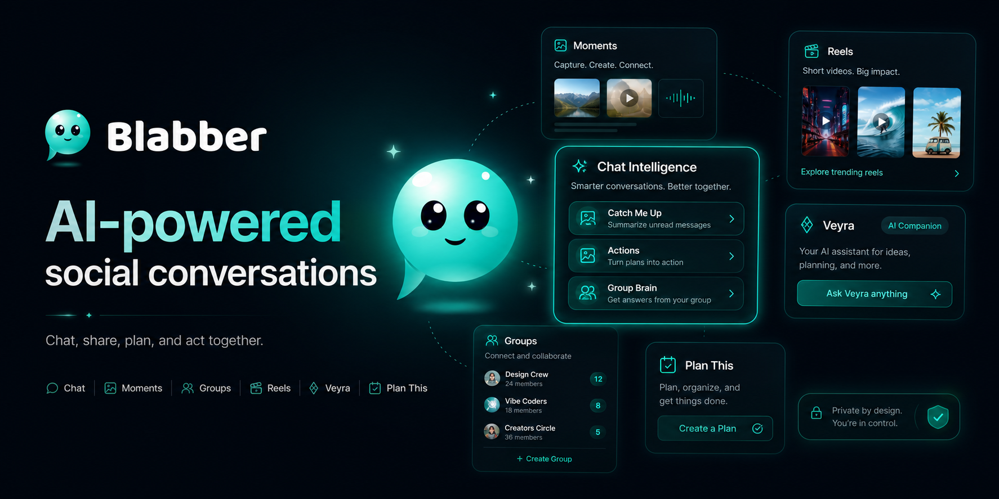
</p>

# Blabber

AI-native social messaging platform for chat, reels, planning, actions, and permission-aware conversation intelligence.

<p align="center">
  
  
  
  
  
  
  
  
  
  
</p>

<p align="center">
  <a href="https://app.blabber.dev"><strong>Live App</strong></a>
  · <a href="#architecture">Architecture</a>
  · <a href="#features">Features</a>
  · <a href="#tech-stack">Tech Stack</a>
  · <a href="#local-setup">Local Setup</a>
  · <a href="#testing-and-reliability">Testing</a>
</p>

<p align="center">
  YouTube Walkthrough: Coming soon
</p>

## Overview

Blabber helps people find ideas, share them with their people, and turn conversations into real plans. It is built as an AI-native social messaging platform where chat, media, reels, planning, tasks, calls, and permission-aware intelligence all live in one product surface.

The problem is simple: conversations contain decisions, tasks, links, files, plans, and questions, but they get buried. Blabber makes conversations useful again by turning live discussion into structured context that users can search, summarize, act on, and revisit.

The primary demo surface is the production web app with mobile-friendly browser support at [app.blabber.dev](https://app.blabber.dev). The repo also includes an Expo mobile app as a partial native surface, with ongoing work toward fuller native parity.

## Features

| Feature | What it does | Why it matters |
| --- | --- | --- |
| Direct & Group Messaging | Real-time 1:1 and group chats with replies, reactions, reads, pinning, saves, reports, polls, events, and media attachments. | Keeps everyday coordination fast while preserving the context that matters later. |
| Moments | Short-lived social updates with audience-aware viewing and interactions. | Adds lightweight social presence beyond long-running chats. |
| Feed & Discover | Public and permission-aware social browsing surfaces for posts, profiles, topics, and reels. | Helps users find ideas and people without losing privacy boundaries. |
| Reels | Video-first discovery and playback with direct reel routes and suggested content. | Makes visual ideas easy to browse, share, and turn into plans. |
| Catch Me Up | Summarizes recent direct or group conversation context. | Reduces catch-up time when a chat moves faster than the user can read. |
| Actions / My Actions | Extracts and tracks action items from conversations. | Turns "we should do this" into visible follow-through. |
| Group Brain | Answers questions from group conversation context. | Gives a group shared memory without making everyone scroll. |
| Plan This | Converts a post or reel into a planning flow with duplicate prevention and retry-safe finalization. | Bridges inspiration and coordination. |
| Veyra | A personal AI layer with approved spaces, full-access mode, and permission-aware retrieval. | Lets users ask across accessible context while keeping access user-controlled. |
| Calls | Audio/video calling built around LiveKit and chat-linked call flows. | Keeps real-time conversation inside the same workspace. |
| Media Uploads | Images, documents, voice, avatars, HEIC/HEIF/JPG/PNG compatibility, scanning, and local/S3-style media flows. | Makes shared context richer while validating and scanning uploads. |
| Profiles & Settings | Profiles, handles, avatars, privacy controls, blocked users, notifications, theme, and account settings. | Gives users identity and control over how they participate. |

## AI Intelligence

Blabber's intelligence features are designed around conversation utility, not generic chatbot novelty. The goal is to help users recover context, understand decisions, and move from discussion to action while respecting the permissions attached to each chat, post, reel, or space.

### Catch Me Up

Catch Me Up summarizes recent conversation context in direct chats and groups. It is built for the moment when a user opens a busy thread and needs the shape of what happened without manually scrolling through every message.

### Actions

Actions identify follow-ups that emerge from conversation. My Actions gives users a place to see their own outstanding items, while ambiguous group actions can remain unassigned until ownership is clear.

### Group Brain

Group Brain answers questions using group chat context. It is meant for questions like "what did we decide?", "who is handling this?", or "what are the open questions?" It is hidden where group context does not apply.

### Plan This

Plan This turns posts and reels into shared planning flows. It is designed to keep planning grounded in the original source, prevent duplicate plans, and handle retries gracefully.

### Veyra

Veyra is Blabber's personal conversation intelligence layer. Users can approve specific spaces for access, enable full access when they want broader retrieval, and return to approved-space mode when they prefer narrower scope.

Veyra uses permission-aware retrieval against accessible content and is designed to give grounded answers. When there is not enough evidence in the user's accessible context, the intended behavior is to say so rather than inventing an answer. Blabber does not claim that AI can never be wrong; it is built to make scope, evidence, and user-controlled access first-class parts of the experience.

## Product Gallery

Real production screenshots from Blabber's web app and mobile-friendly browser experience.

<table>
  <tr>
    <td width="50%">
      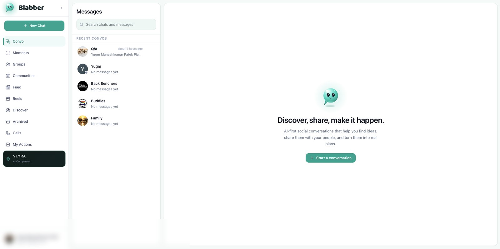
      <br />
      <strong>Messages</strong>
      <br />
      <sub>New Chat, search, conversations, and the core messaging workspace.</sub>
    </td>
    <td width="50%">
      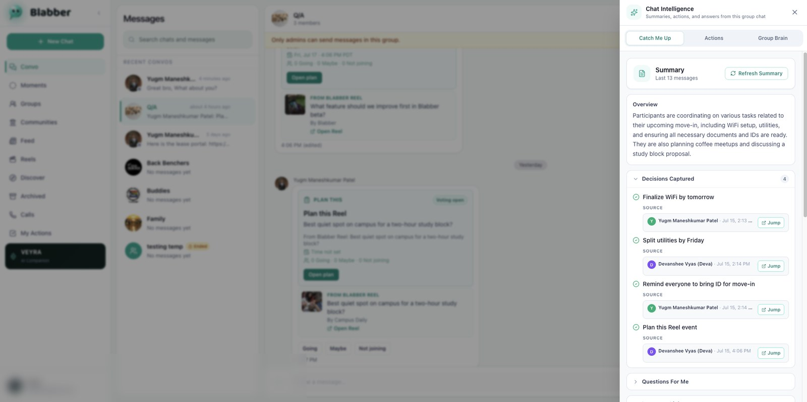
      <br />
      <strong>Catch Me Up</strong>
      <br />
      <sub>Conversation summaries with decisions, links, tasks, and grounded source jumps.</sub>
    </td>
  </tr>
  <tr>
    <td width="50%">
      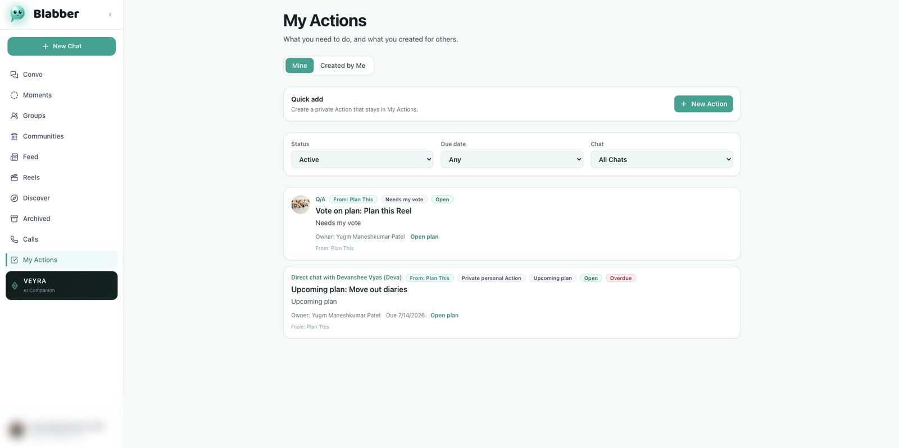
      <br />
      <strong>Actions / My Actions</strong>
      <br />
      <sub>Action items from direct chats, groups, and planning flows in one place.</sub>
    </td>
    <td width="50%">
      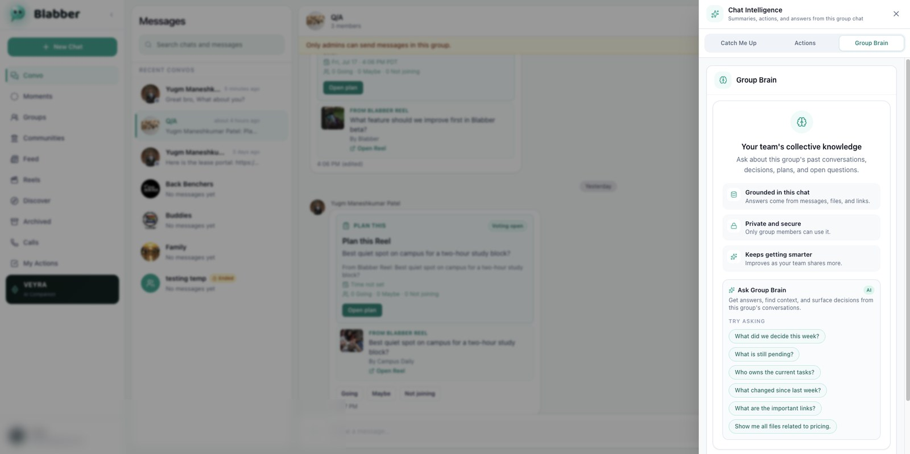
      <br />
      <strong>Group Brain</strong>
      <br />
      <sub>Group-only Q&A over shared decisions, files, links, plans, and open questions.</sub>
    </td>
  </tr>
  <tr>
    <td width="50%">
      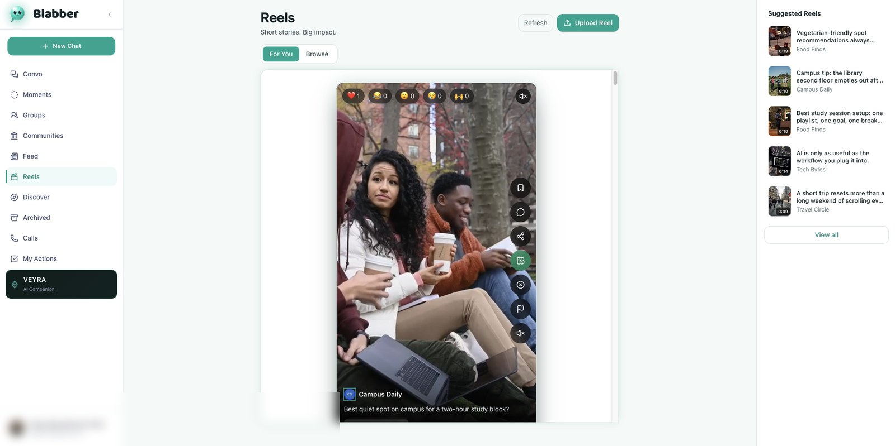
      <br />
      <strong>Reels</strong>
      <br />
      <sub>Short-form video discovery with suggested reels and Plan This entry points.</sub>
    </td>
    <td width="50%">
      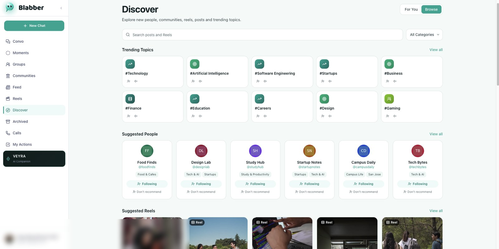
      <br />
      <strong>Discover</strong>
      <br />
      <sub>Trending topics, suggested people, posts, profiles, and reels.</sub>
    </td>
  </tr>
  <tr>
    <td width="50%">
      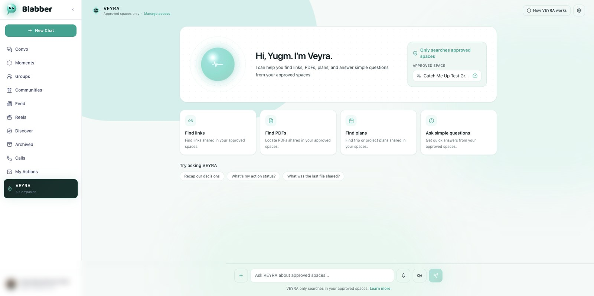
      <br />
      <strong>Veyra</strong>
      <br />
      <sub>Permission-aware AI assistant for approved spaces and accessible Blabber context.</sub>
    </td>
    <td width="50%">
      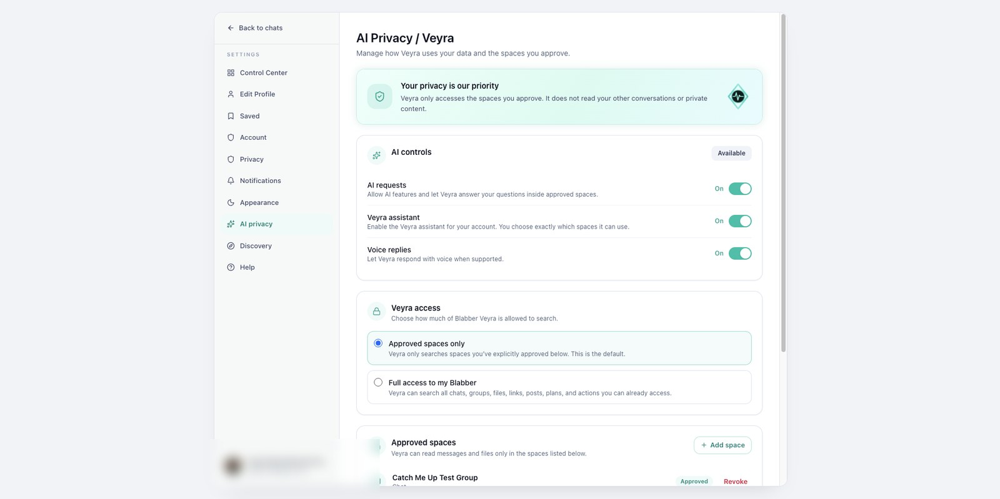
      <br />
      <strong>AI Privacy</strong>
      <br />
      <sub>Approved Spaces and Full Access controls for user-controlled retrieval.</sub>
    </td>
  </tr>
</table>

<details>
  <summary><strong>More screenshots</strong></summary>

| Area | Screenshot |
| --- | --- |
| Login | 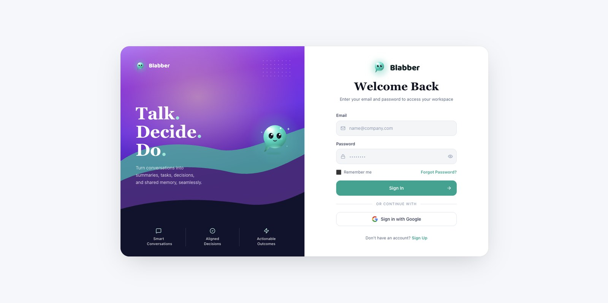 |
| Direct Chat | 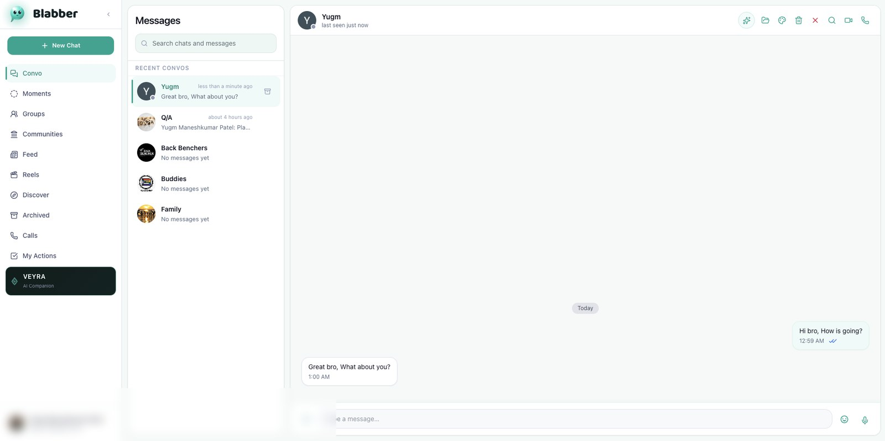 |
| New Chat | 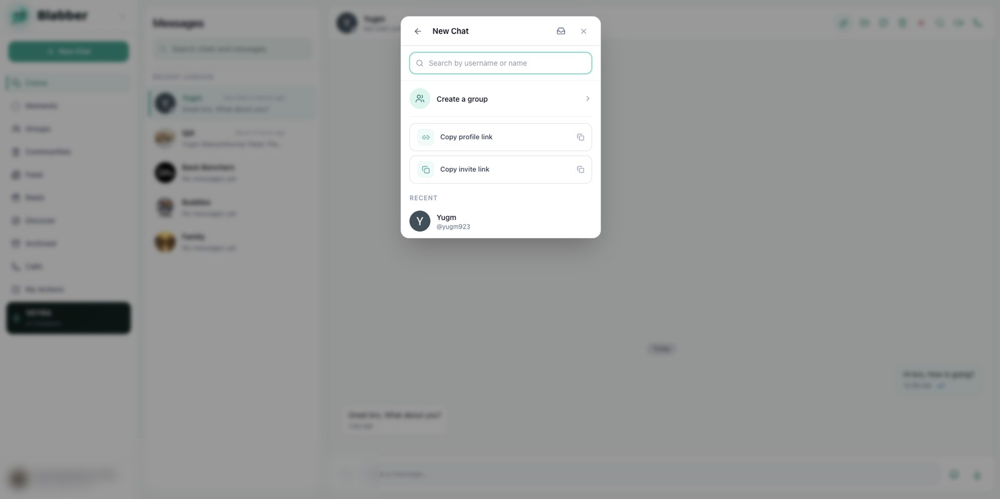 |
| Direct Catch Me Up | 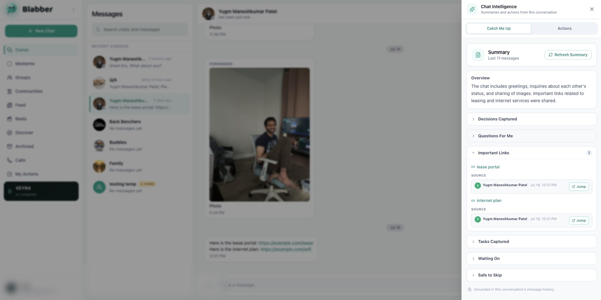 |
| Group Actions | 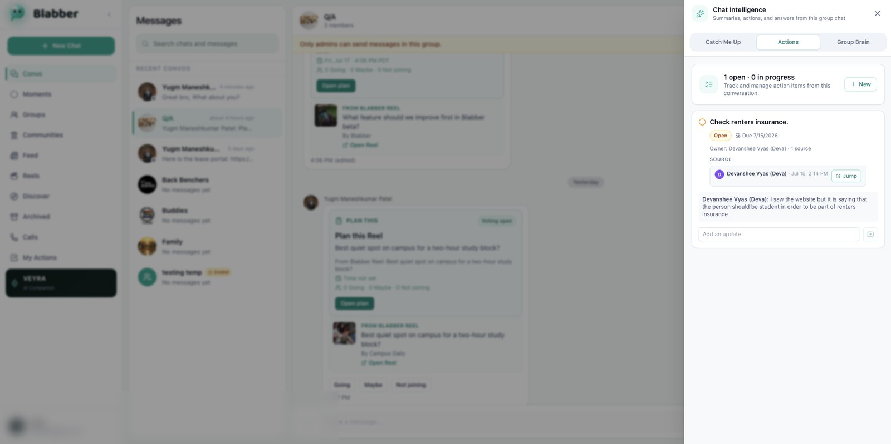 |
| Moments | 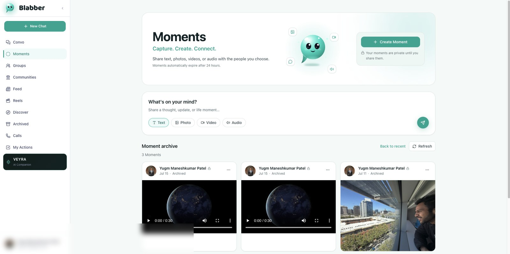 |
| Feed | 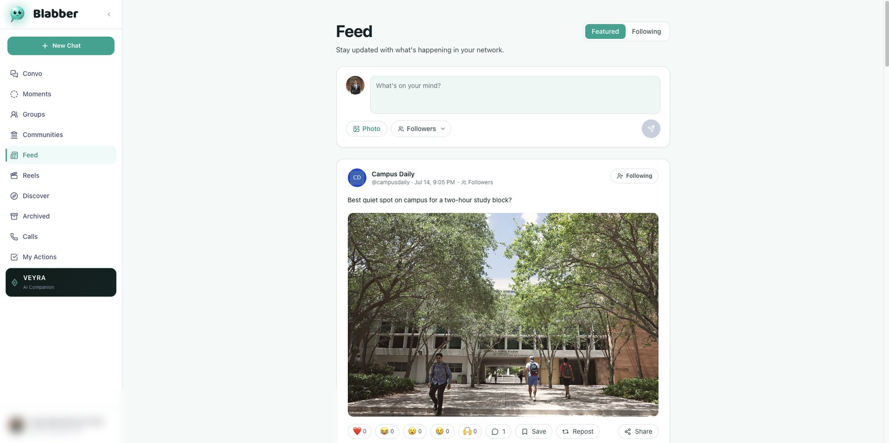 |
| Discover For You | 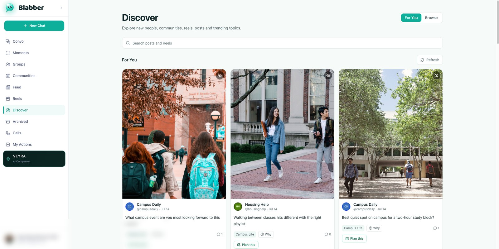 |
| Public Profile | 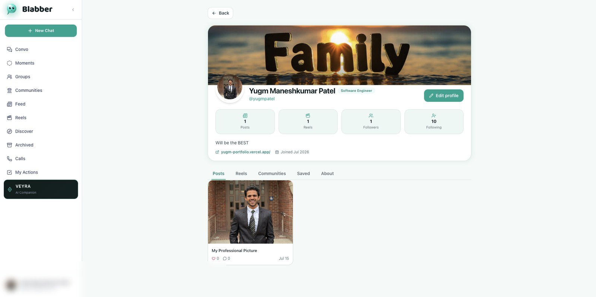 |
| Mobile Web | 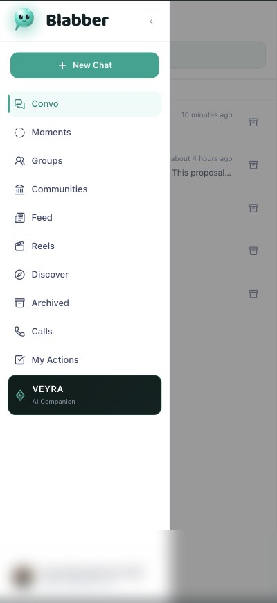 |

</details>

## Architecture

<p align="center">
  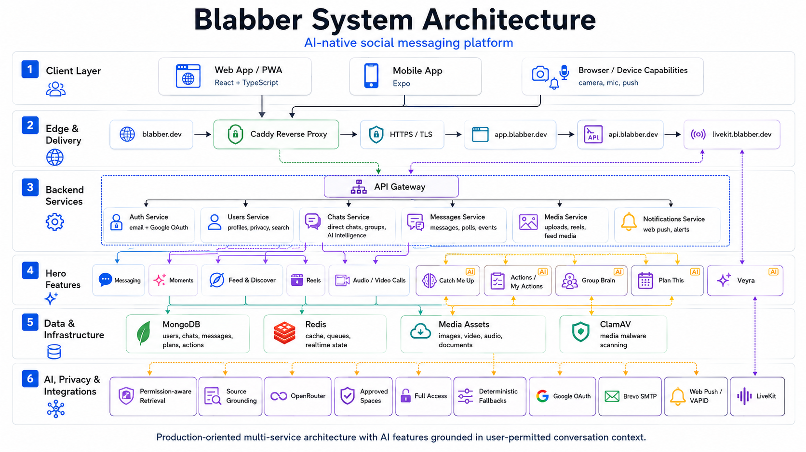
</p>

Blabber is organized as a production-style monorepo with a React web app, an Expo mobile app, an API gateway, dedicated backend services, shared packages, and Docker Compose orchestration. The production web app with mobile-friendly browser support is the primary demo surface; the Expo app provides a native foundation for mobile experiences.

Production runs behind Caddy with HTTPS for `app.blabber.dev`, `api.blabber.dev`, and `livekit.blabber.dev`. The web app talks to the API gateway, which handles browser-facing HTTP routing and Socket.IO realtime connections before forwarding service-specific work to auth, users, chats, messages, media, and notifications services.

MongoDB stores users, sessions, chats, messages, media metadata, social content, and intelligence state. Redis supports pub/sub, realtime fanout, rate limits, and service coordination. Media flows include local development storage and S3-style presign support when configured.

External integrations include LiveKit for calls, ClamAV for media scanning, OpenRouter for AI provider access, Google OAuth for sign-in, Brevo-compatible SMTP for email, and Web Push/VAPID for browser notifications. Secrets are supplied through environment configuration and are not committed to the repository.

## Tech Stack

| Area | Technologies |
| --- | --- |
| Frontend | React, TypeScript, Vite, Tailwind CSS, React Query, Zustand, React Router, PWA assets |
| Backend | Node.js, Express, TypeScript, Zod, shared config/types/utils packages |
| Data | MongoDB, Redis |
| AI | OpenRouter-compatible chat completion flows, permission-aware retrieval, grounded response patterns |
| Media & Realtime | LiveKit, Socket.IO, ClamAV, local media storage, S3-style presigned upload support, Web Push/VAPID |
| Infrastructure | Docker Compose, GCP Compute Engine, Caddy HTTPS, NGINX web container, pnpm workspaces, Turbo |
| Testing | Vitest, service tests, static smoke checks, release smoke harnesses, production config verification |
| Mobile | Expo, React Native, Expo Router, secure storage, native media/push foundations |

## Project Structure

| Path | Purpose |
| --- | --- |
| `apps/web` | React web application with PWA-oriented assets. |
| `apps/mobile` | Expo mobile app foundation. |
| `apps/gateway` | API gateway, HTTP proxying, Socket.IO, rate limits, realtime room handling. |
| `services/auth` | Registration, login, refresh sessions, logout, password reset, Google OAuth, current user routes. |
| `services/users` | Profiles, handles, search, blocks, follows, communities, settings, invite and discovery APIs. |
| `services/chats` | Direct/group chats, members, chat intelligence, actions, Group Brain, Veyra, planning routes. |
| `services/messages` | Message list/send/edit/delete, reactions, read state, polls, events, shared content. |
| `services/media` | Upload policy, media records, local upload serving, link previews, reels, scanning, normalization. |
| `services/notifications` | Push subscriptions, notification preferences, and web push delivery routes. |
| `packages/types` | Shared TypeScript types and Zod schemas. |
| `packages/config` | Shared environment loaders and production safety checks. |
| `packages/utils` | Shared errors, middleware, logging, Redis/pubsub helpers, and service utilities. |
| `docs` | Architecture, production, release, hardening, and operational documentation. |
| `scripts` | Smoke suites, release verification, backup helpers, config checks, and controlled content tooling. |

## Production Deployment

Blabber is deployed on GCP Compute Engine using Docker Compose and Caddy-managed HTTPS. The production domains are:

| Domain | Role |
| --- | --- |
| `https://app.blabber.dev` | Production web app |
| `https://api.blabber.dev` | Public API gateway |
| `https://livekit.blabber.dev` | LiveKit endpoint |

Deployment documentation lives in [`docs/production-cicd.md`](./docs/production-cicd.md). Production secrets, provider keys, OAuth credentials, SMTP credentials, VAPID keys, and database credentials are not stored in the repository.

## Testing And Reliability

Blabber includes a layered verification strategy:

- Unit and service tests through Vitest.
- Static smoke checks for dashboard copy, chat controls, media compatibility, and durable product contracts.
- Release smoke harnesses for auth, safety, operations, Moments, profiles, feed, communities, discovery, reels, mobile foundation, cross-platform QA, and hardening.
- Production configuration verification for unsafe environment settings.
- Docker health/readiness checks for the composed stack.

Recent hardening has focused on Catch Me Up, Actions, Group Brain, Plan This, Veyra approved spaces/full access, mobile-friendly browser ergonomics, Reels/Feed/Discover playback and navigation, media scanning, upload compatibility, and static smoke coverage.

Useful commands:

```bash
pnpm test
pnpm smoke:chat-dashboard
pnpm smoke:release-g-hardening
pnpm verify:production-config
pnpm verify:launch-gate
```

## Local Setup

### Prerequisites

- Node.js `20.11.0` or compatible Node 20 runtime
- pnpm `8.15.0`
- Docker Desktop or another Docker Compose compatible runtime

### Clone And Install

```bash
git clone https://github.com/YugmPatel/Blabber.git
cd Blabber
pnpm install
cp .env.example .env
```

Fill in local development values in `.env`. Do not commit real secrets.

### Run The Full Stack With Docker

```bash
pnpm docker:full:up
```

Open:

```text
http://localhost:5173
```

Gateway health:

```text
http://localhost:3000/healthz
```

Check and stop containers:

```bash
docker compose -f docker-compose.full.yml ps
pnpm docker:full:logs
pnpm docker:full:down
```

### Run Individual Workspaces

```bash
pnpm dev
pnpm --filter ./apps/web dev
pnpm --filter @apps/gateway dev
pnpm --filter @services/auth dev
pnpm --filter @services/users dev
pnpm --filter @services/chats dev
pnpm --filter @services/media dev
pnpm --filter @services/notifications dev
pnpm --filter @apps/mobile start
```

### Build

```bash
pnpm build
pnpm --filter web build
pnpm --filter @apps/mobile check
```

## Environment Variables

Use `.env.example` as the template. Keep real values out of Git and avoid putting secrets in `VITE_` or `EXPO_PUBLIC_` variables unless they are intentionally public client values.

| Group | Examples |
| --- | --- |
| Database | `MONGO_URI`, `MONGO_DB_NAME`, `REDIS_HOST`, `REDIS_PORT`, `REDIS_PASSWORD` |
| Auth | `JWT_ACCESS_SECRET`, `JWT_REFRESH_SECRET`, token TTLs, `ALLOWED_ORIGINS`, Google OAuth client settings |
| AI | `OPENROUTER_API_KEY`, `OPENROUTER_MODEL`, OpenRouter referer metadata, mock fallback flags |
| Email | `SMTP_HOST`, `SMTP_PORT`, `SMTP_SECURE`, `SMTP_STARTTLS`, `SMTP_USER`, `SMTP_PASS`, `SMTP_FROM` |
| Push | `VAPID_PUBLIC_KEY`, `VAPID_PRIVATE_KEY`, `VAPID_SUBJECT` |
| LiveKit | `LIVEKIT_API_KEY`, `LIVEKIT_API_SECRET`, `LIVEKIT_WS_URL`, `VITE_LIVEKIT_WS_URL` |
| Media scanning | `CLAMAV_HOST`, `CLAMAV_PORT`, scanner timeout settings, media base/upload URLs |
| Frontend routing | `VITE_API_URL`, `VITE_SOCKET_URL`, allowed local fallback flags |

## API Overview

All browser-facing APIs go through the gateway.

| Gateway path | Service | Purpose |
| --- | --- | --- |
| `/api/auth` | Auth service | Register, login, refresh, logout, password reset, OAuth, current user. |
| `/api/users` | Users service | Profiles, settings, search, blocks, follows, communities, invites, discovery. |
| `/api/chats` | Chats service | Direct/group chats, members, archive/pin, actions, Group Brain, planning, Veyra. |
| `/api/messages` | Messages service | Message list/send/edit/delete, reactions, reads, polls, events, shared content. |
| `/api/media` | Media service | Uploads, media records, local media, previews, reels, scanner-backed validation. |
| `/api/notifications` | Notifications service | Push subscription, preferences, unsubscribe, and delivery routes. |

## Service Ports

| Service | Local port |
| --- | --- |
| Web app | `5173` |
| Gateway | `3000` |
| Auth service | `3001` |
| Users service | `3002` |
| Chats service | `3003` |
| Messages service | `3004` |
| Media service | `3005` |
| Notifications service | `3006` |
| MongoDB | `27018` on host, `27017` in Docker network |
| Redis | `6380` on host, `6379` in Docker network |
| LiveKit | `7880`, `7881`, `7882/udp` in the full stack |

## Author

Built by Yugm Patel.

- GitHub: [YugmPatel](https://github.com/YugmPatel)
- LinkedIn: Coming soon / add your LinkedIn URL
